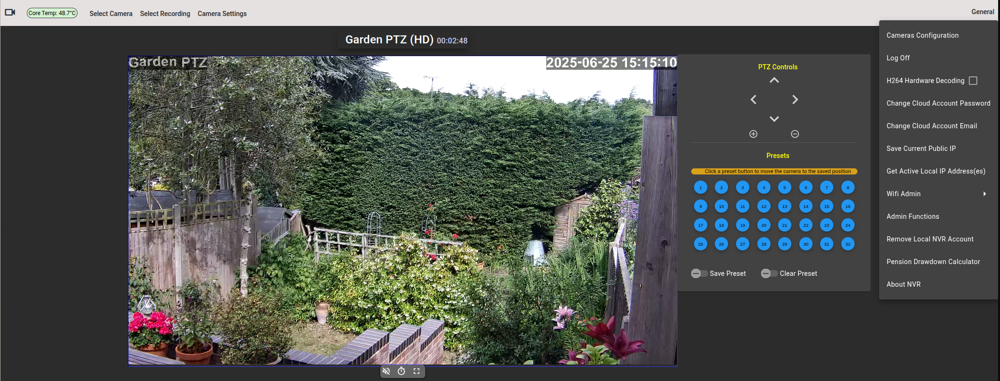

<h2 style="text-align: center">Security Cam Cloud Service</h2>
<h2 style="text-align: center">Cloud Service for Hosting Multiple Security Cam Instances</h2>

### Introduction
#### Why A Cloud Service?
The Cloud Service is intended for use with the Security Cam NVR project. Many network CCTV cameras
can be set up, controlled and viewed online via an app which links to the cameras
through a Cloud Service designed for those devices. This Cloud Service gives that sort of control of the security-cam NVR
while not requiring port forwarding or a local account on the NVR. Multiple NVRs can
be accessed through the Cloud Service, each having its own user account for private access,

*NVR Accessed with Cloud Service (with general menu selected)*

The Cloud Service also has an admin account which allows observing NVR product IDs, whether they have accounts,
are online and how many users are connected to their NVRs
through the Cloud service. An administrator can also change NVR Cloud account passwords, email addresses as
well as enable/disable or delete NVR Cloud accounts.

*Accounts Admin (editable table)*

The <a href="https://github.com/richard-austin/security-cam">Security Cam</a> (NVR, Network Video Recorder) project is primarily 
designed to run without the need for a cloud service, inside a secure LAN, with access from WAN being made available 
with port forwarding. The Cloud Service can be used to provide access to a number of NVR instances
without the port forwarding set up, as the NVR makes a client connection to the ActiveMQ service which is the
bridge between one or more NVRs and the Cloud Service.

The Cloud Service is intended to be run at a public internet address, to which instances of Security Cam
are configured to connect via an <a href="https://github.com/richard-austin/activemq-for-cloud-service">ActiveMQ</a> 
server to the Cloud Server. The NVR does not need to have a local user account set up to connect to the Cloud Service. 
Instead a user account is created on the Cloud Service for each NVR connected to it. When the user account is created,
the required username, password and email address are entered along with the NVR's unique product ID
by which the Cloud Service identifies the specific NVR, 
When an NVR has no local account, it will attempt to connect to the Cloud Service by default.

### Description
The Cloud server application consists of a Java (Grails) server side with an Angular 12 web application for the
client side. The Angular client has two operating modes, as an admin application (for the admin user), and client
mode for users who login to use their NVR. In client mode, the server side acts as a proxy to the connected NVRs
with user accounts, so most restful API calls are made through this proxy to the users NVR. The Cloud Service can handle
multiple NVRs and each connected NVR must have a user account set up on the Cloud Service to give client access
to it. Each NVR is associated with its user account with a unique product ID that is set on the NVR on
initial installation, and is entered along with the account data when the account is originally set up. Each connected NVR
has its own individual proxy interface to its web server backend. The Cloud Service logs onto the NVRs using a special
secure access Cloud Account.
#### Cloud Service Features
* Hosts multiple NVRs with each one having its own user account
* Linked to NVRs via ActiveMQ
* When not logged in
  * Login as admin or to one of the client accounts.
  * Register a new client (NVR) account.
* Admin Access
  * Set up or modify host, username and password for ActiveMQ connection.
  * Change admin account password.
  * Show list of connected NVRs
  * Indicate which NVRs have Cloud accounts
  * Indicate which NVRs with Cloud accounts are connected to the Cloud.
  * For each NVR, show number of users viewing the NVR through the Cloud Service.
  * Change users Cloud account password.
  * Change users Cloud account email address.
  * Enable/Disable users Cloud account.
  * Delete Users Cloud Account.
  * Show only accounts where the NVR is offline (not connected to Cloud)
  * Show only connected NVRs with no Cloud user account set up.
  * NVR list filter for username/product id
* Client NVR access
  * Most features present through direct access to the NVR are present with client access on the Cloud.
Camera web admin pages are not accessible through the Cloud as they are with direct NVR access. The Admin functions
are not present, though you can add or remove the local NVR account.
  * NVR configuration  
  * Add/Remove local NVR account.
### Run time platform, for Cloud Service
The current build configuration (as created with./gradlew buildDebFile) is for Raspberry pi V4 running headless (server) 
version of Ubuntu 24.04 (Noble Numbat). The application runs on Java on the server side, so it can easily be adapted 
to other platforms.
### Tomcat Web Server
Tomcat 9 (https://tomcat.apache.org/) hosts the server (Web Back End) and client (Web Front End) of the NVR, giving access
to these through port 8080.
### Web Front End
The Web Front End (client) is an Angular application using [Angular CLI](https://github.com/angular/angular-cli) version 12.0.5 or later.
This forms the user interface of the web application.
To get more help on the Angular CLI use `ng help` or go check out the [Angular CLI Overview and Command Reference](https://angular.io/cli) page.
### Web Back End
The Web Back End (server) is a Grails application (https://grails.org/), which provides
a Restful API for the Angular Web Front End in admin mode. In client mode, the Restful API is mainly from
the NVR via the account proxy.
### ActiveMQ
ActiveMQ is deployed separately from the Cloud Service.
The ActiveMQ service is configured to use a protocol, credentials and certificates known to both the
NVRs and the Cloud Service. It can be co hosted with the Cloud Service or run separately. In either case,
both the NVRs and Cloud Service must be configured to connect to the ActiveMQ host address. The ActiveMQ project
<a href="https://github.com/richard-austin/activemq-for-cloud-service">here</a> is configured for
use with the NVR and Cloud projects, though you will need to edit the cloudActiveMQUrl in the NVRs
application.yml and mqURL in the Cloud Service application.yml file for those to point to the host on which ActiveMQ
is running.

## Building the project
Ready built .deb files are included in the Releases section, otherwise read the directions below.
#### The project is verified to build with the following:-
* Angular CLI: 15.2.0 or greater
* Node: 18.17.1
* npm: 9.9.7
* Package Manager: npm 9.6.7
* Grails Version: 5.3.2
* openjdk version "19.0.2" 2023-01-17
* Gradle 7.6

Using other versions may cause build issues in some cases.
### Set up build environment
```
git clone git@github.com:richard-austin/cloud-server.git
cd cloud-server
```
### Build for deployment to Raspberry pi
```
./gradlew buildDebFile 
```
This will create a deb file with a name of the form cloud_*VERSION*-*nn*-*ID-dirty*_arm64.deb
Where:-
* *VERSION* is the most recent git repo tag
* *nn* Is the number of commits since the last git tag (not present if no commits since last tag.)
* *ID* The last git commit ID (not present if no commits since last tag.)
* *dirty* "dirty" is included in the name if there were uncommitted changes to the source code when built.

When the build completes navigate to where the .deb file was created:-
```
cd xtrn-scripts-and-config/deb-file-creation
```
scp the .deb file to the Raspberry pi
## Installation on the Raspberry pi
The Raspberry pi should be running Ubuntu 24.04 (Noble Numbat) OS.
```
sudo apt update
sudo apt upgrade 
```
(restart if advised to after upgrade)

Navigate to where the .deb file is located
<pre>
sudo apt install ./<i>deb_file_name</i>.deb
</pre>
* Wait for installation to complete.
* The Tomcat web server will take 1 - 2 minutes to start
  the application.
* <i>If this is the first installation on the Raspberry pi..</i>
  * <i>Generate the site certificate..</i>
    ```
    cd /var/cloud-server
    sudo ./install-cert.sh
    ```
    Fill in the details it requests (don't put in any information you are not happy with being publicly visible, for
    example you may want to put in a fake email address etc.)
  * nginx will not have started in the absence of the site certificate, so restart nginx.
    ```
    sudo systemctl restart nginx
    ```
## ActiveMQ
Messages between the Cloud Service and the NVRs pass through an <a href="https://github.com/richard-austin/activemq-for-cloud-service">ActiveMQ</a> service.
Both the Cloud Server and NVRs must be configured to connect to the same ActiveMQ instance using the
correct credentials (see [Admin Mode](#set-amq-connection) section)
## Initial Setup
#### Set up admin user account password
The admin account is set up with the default password *elementary*, this should be changed first of all.
* Set a browser to <a>https://<i>cloud-server_ip_addr</i></a>
* Ignore the warning which may be given as a result of the home generated
  site certificate and continue to application which will show the menu bar.
* Click on the *Log in* option on the menu bar
* Enter *admin* as the user name and *elementary* as the password.
* Click confirm.
* Click on *General* on the right had side of the menu bar.
* Click on *Change Password*
* Enter *elementary* as the current password
* Enter you new password and again in the confirm box.
* Click on *Change Password*
* The new password is now set up.

## Admin Mode
To enter administrator mode: -
* Set a browser to https://cloud-server_ip_addr (ip address of the Cloud Service).
* Click on the *Log in* option on the menu bar.
* Enter *admin* as the username and the admin password you set above as the password.
* On the menu bar, select *Admin -> Accounts Admin*. A table listing connected NVRs and NVR Cloud
  Service accounts will be shown.

<a id="set-amq-connection"></a> 
#### Set ActiveMQ user name and password
To connect to ActiveMQ, the correct credentials and ActiveMQ host have to be entered. This should be done when
you log onto the Cloud Server as admin for the first time: -

* Open the General menu and select "Set ActiveMQ Credentials"
* Enter the username (usually cloud) given on initial installation of **activemq-for-cloud-service**
* Enter the password given on initial installation of **activemq-for-cloud-service** (this will be a 20 character
  string consisting of upper and lower case letters and numbers).
* Enter the password again in the **Confirm Password** field
* Enter the ActiveMQ host (this can be an IP address or hostname).
* Click the **Update Creds** button, the new settings will be applied.
##### Updating the ActiveMQ username and password
* Open the General menu and select **Set ActiveMQ Credentials**
* The credentials can be changed by the admin user at any time by repeating the above procedure, the current ActiveMQ
  host will appear as the default in the ActiveMQ Host field.
* Click the **Update Creds** button, the new settings will be applied.
##### Changing the ActiveMQ Host
* Open the General menu and select "Set ActiveMQ Credentials"
* To change the host without changing the username and password, leave the username and password fields blank
  and update the ActiveMQ host field only.
* Click the **Update Creds** button, the new settings will be applied.

#### Client Account Administration

These functions are available under Admin -> Accounts admin on the main menu. A table of 
NVRs/users is shown which lists NVRs which are either connected, have accounts set up or both.


*Accounts Admin (editable table)*

In the screenshot above, the Accounts Admin table is show. This table allows the Cloud Service administrator to perform
various operations on NVR Cloud accounts. There are two NVRs are listed, the top one shows a connected NVR for which
no account has yet been created, while the bottom one shows a connected NVR for which an account has been created. The list
can also show NVRs for which an account has been created but are not currently connected to the Cloud Server.

The following functions are available: -


| Column                 | Usage                                                                                                                                                                                                    |
|------------------------|----------------------------------------------------------------------------------------------------------------------------------------------------------------------------------------------------------|
| Change Password        | Change the password for an NVR Cloud Account. Click on the button and edit using the drop down dialogue box.                                                                                             |
| Change Email Address   | Change the email address for an NVR Cloud Account.  Click on the button and edit using the drop down dialogue box.                                                                                       |
| Enable/Disable Account | Enable or disable the NVR cloud account. When disabled, the Cloud client account will not be usable (log in will fail). Click on the checkbox to change state.                                           |
| Delete Account         | Completely removes the NVR Cloud account. The user will be able to recreate an account using their NVR product ID. Click on the button to delete the account and confirm or cancel on the drop down box. |
| Product ID             | Shows the product ID of the NVR for that account. The product ID associates a user name with a specific NVR. This is not an editable field.                                                              |
| Account Created        | Shows a green user icon if an account has been created for the NVR, or a red bell icon if no account has yet been created. This is not an editable field.                                                |
| Username               | Shows the account username. This will be blank if no account has yet been created. This is not an editable field.                                                                                        |
| NVR Connected          | Shows a green circular arrows icon if the NVR is connected, or a red circular arrows with exclamation mark icon if not connected. This is not an editable field.                                         |
| Users connected        | Shows the number of users connected to the Cloud via that client/NVR account. The number of users can take a minute or so to change when a user disconnects. This is not an editable field.              |
Note that these functions only affect the client/NVR cloud account. Any local account on the NVR will be unaffected.

## Client Mode
In client mode you are connected to your NVR and can use the functions of that NVR. This includes viewing live CCTV streams, selecting
recordings by date and time and viewing them, set certain camera parameters and configure camera setup including Wi-Fi.
#### Requirements To Access NVRs Through The Cloud
* There must be at least one NVR with its cloudProxy -> cloudHost configuration in application.yml set to the 
ip address of the Cloud Service. The cloudPort number is normally 8081. 
* The Cloud Service may be hosted at a public IP address or within the same LAN as the NVRs.
* On the NVRs which are  to connect to the Cloud, ensure the cloud proxy is enabled (checkbox checked at 
General -> Set CloudProxy Status).
* There must be a Cloud user account for each NVR you connect to the cloud. To set up Cloud user accounts, you will need
the unique product ID for each of the NVRs. The product ID is shown towards the end of the text which is displayed
during the initial installation of the NVR software. It can also be seen on the User Accounts list with the Cloud admin account.
* Set up a Cloud user account for NVR: -
  * Connect a web browser to the Cloud.
  * Select *Create Account* on the menu bar.
  * Enter the username for the intended NVR (this is for the cloud account and does ***not***  have to be the same username
as an existing user account on the NVR).
  * Enter the NVRs 16 character unique product ID.
  * Enter the account password and confirm it (this is for the cloud account and does ***not*** have to be the same password
as an existing user account on the NVR).
  * Enter the email address for the account and confirm it (required for reset password links).
  * Click the *Register Account* button.

With the Cloud user account and the NVR CloudProxy connected to the Cloud, you can now log in.
#### Login to an NVR client account
* Set a browser to https://cloud-server_ip_addr (cloud server ip address)
* Select "Log in" end enter the Cloud account username and password which was set up for the required NVR. There may
be a warning about the self generated site certificate, which can be safely ignored.


When logged into an NVR client account, most functions are the same as when connected directly to the NVR
itself. The differences between direct NVR access vs access through the Cloud are: -
* The Camera Settings -> Camera Admin options where the camera admin pages are hosted is not supported on the Cloud.
* The Camera Settings -> Quick Camera Setup option is not present with the options (only for SV3C and ZXTech cameras)
appearing directly under the Camera Settings menu.
* The Setup Guest Account option is not available through Cloud Access.
* The General -> Change Account Email option is not available via the Cloud. Instead, use General -> Admin Functions, 
then select "Create or Update User Account" (which is also present with direct NVR access).
* With Cloud access, there is the option "General -> Remove Local NVR Account" which is not present with direct NVR access.

#### Client Functions Only Available In Cloud Client Mode
* ***Remove Local NVR Account***
  * Removes the local user account on the NVR. After this operation it will not be possible to log in 
  directly to the NVR. With no local user account on the NVR, this option will be replaced with
  ***Register Local NVR Account***
* ***Register Local NVR Account***
  * Create a user account for direct login to the NVR. Selecting this option brings up a dialogue box
  in which you enter the required username, and enter and confirm the account password and email address.
  * Fill in those details and click the ***Register Account*** button to create the user account.

With a local user account on the NVR, the ***Register Local NVR Account*** option will be replaced by the  
***Remove Local NVR Account*** option.

The email address entered on the form is used to send reset password links for direct NVR login. Reset password links
for Cloud accounts are sent to the email address associated with the Cloud account. The email address is
also used to send changed public IP address warnings (useful when accessing the NVR from outside the LAN through port 
forwarding on the router).
